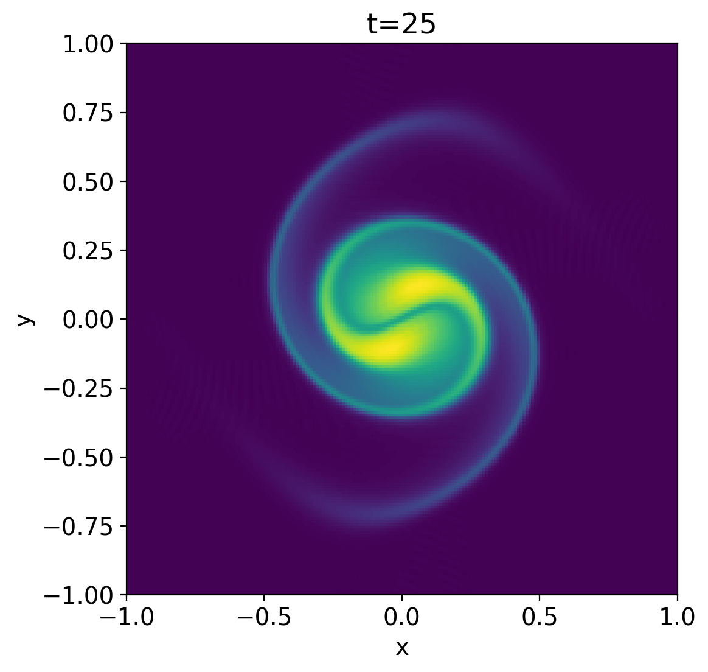
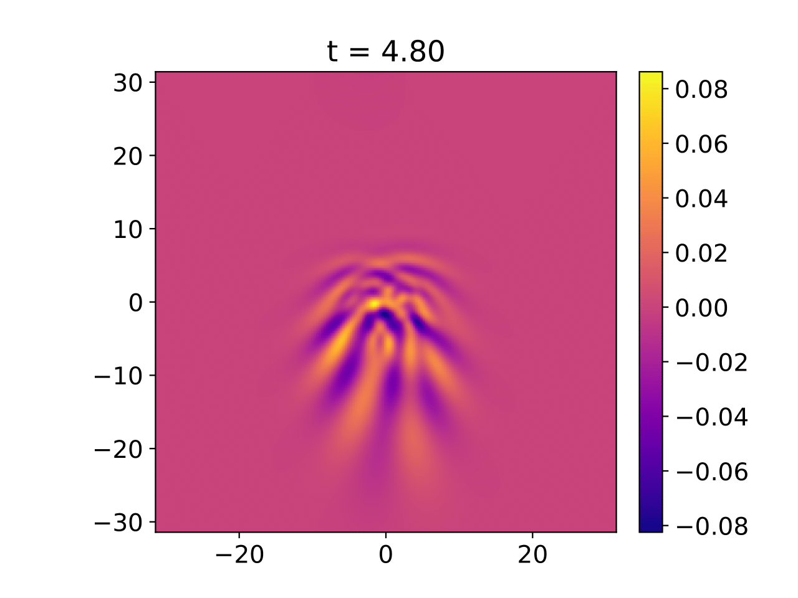
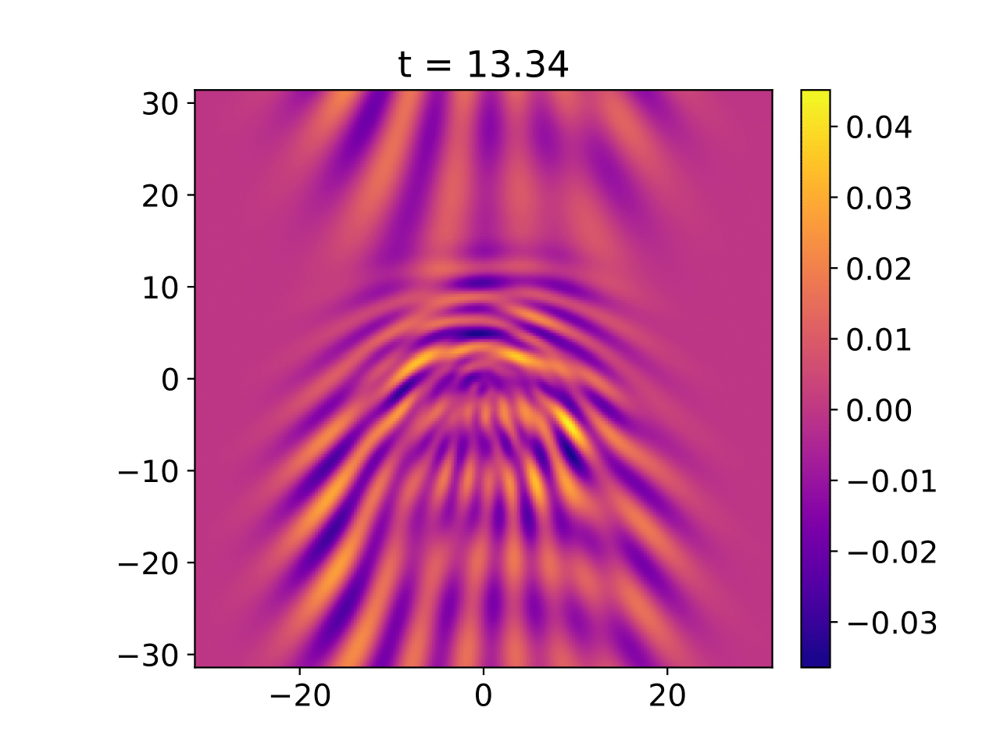
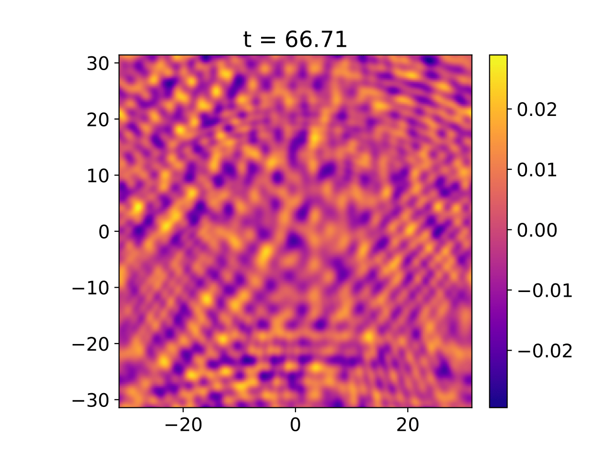
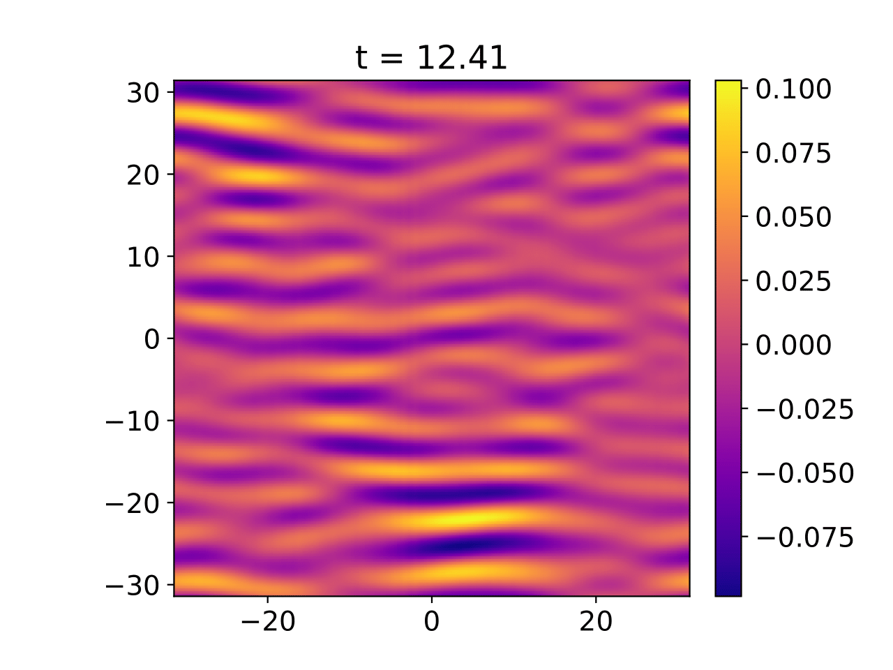
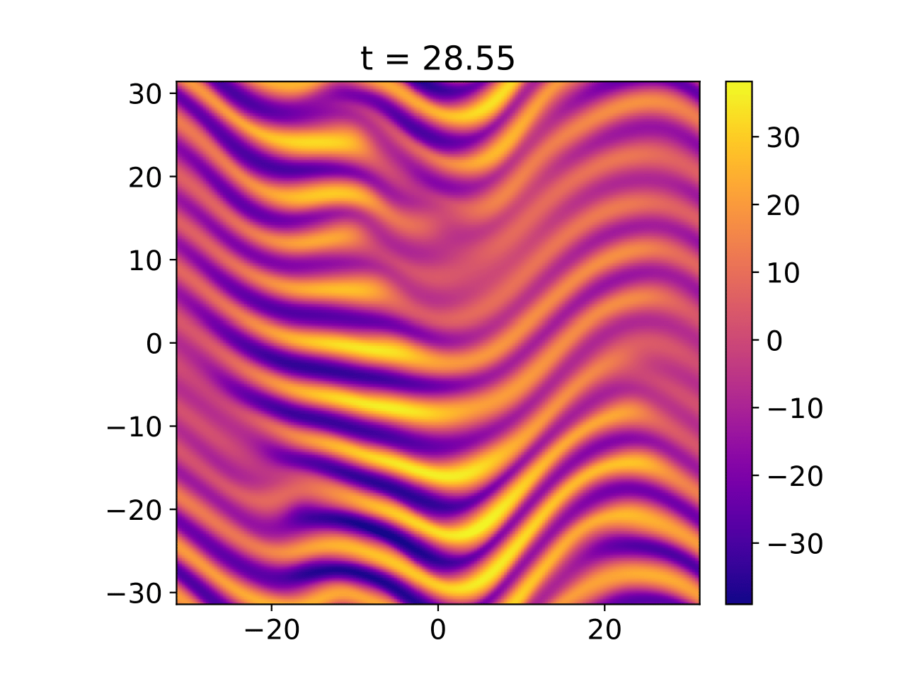
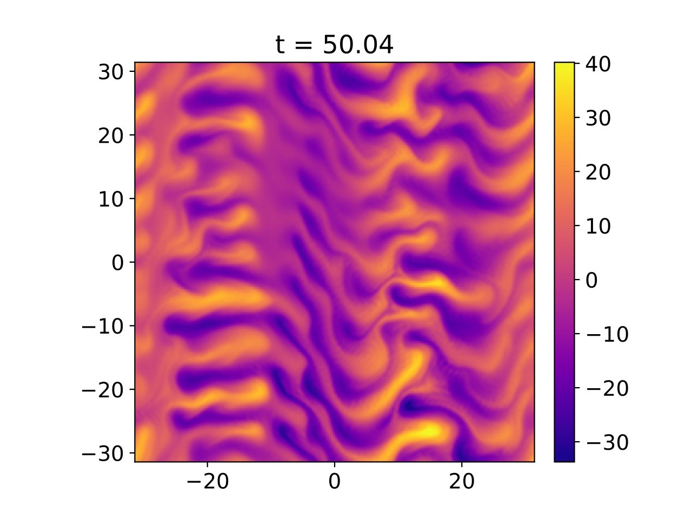

# Simulating Plasma Turbulence Using Dedalus
This page documents my journey through my work on simulating edge plasma turbulence using the [DEDALUS](https://dedalus-project.org/) code under Prof. [Greg Hammett](https://w3.pppl.gov/~hammett/). This project is being done as part of my [PACM](https://www.pacm.princeton.edu/undergraduate) (Program in Applied and Computational Math) certificate project. The precursor to this work was a Finite Volume hydrodynamics code I developed as part of the [APC 523](https://registrar.princeton.edu/course-offerings/course-details?term=1214&courseid=009654) Numerical Algorithms class which can be found on github [here](https://github.com/ikaul00/finite-volume-Navier-Stokes). In particular this work aims to implement the Hasegawa-Mima, Terry-Horton and modified Terry-Horton equations using pseudo-spectral methods to model turbulence in a 2D vertical slice of a tokamak. The preliminary equations for hydrodynamics and the 2D vortex merger test case were adopted from [this paper](https://epubs.siam.org/doi/10.1137/120888053) by Peterson & Hammett. We then use the equations for the HME and THE as presented in previous papers: [this is one](https://www.cambridge.org/core/journals/journal-of-plasma-physics/article/theory-of-the-tertiary-instability-and-the-dimits-shift-within-a-scalar-model/BAE474B82E6B5AD17FA6D9D10111C5FF), [this is another](https://journals.aps.org/prl/abstract/10.1103/PhysRevLett.124.055002) by [Zhu, H](https://theory.pppl.gov/people/profile.php?pid=115&n=Hongxuan-Zhu%E6%9C%B1%E9%B8%BF%E8%BD%A9),  [Dodin, I. Y.](https://theory.pppl.gov/people/profile.php?pid=21&n=Ilya-Dodin) and others. Our new insight is to adopt the shielding factor into the modified THE to better model turbulence in tokamaks. A discussion of the shielding factor and what it exactly is can be found in this [paper](https://aip.scitation.org/doi/10.1063/1.2972160) by my advisor and collaborators. It is know that vertical shears, called zonal flows, get produced during this turbulence, called drift wave turbulence, driven by the ion density gradient. We study the interplay of zonal flows and drift waves by varying the shielding parameter. We will later observe a well known result called the Dimits shift where the zonal flows dominate over drift waves below a certain density gradient threshold as demonstrated in this highly cited [paper](https://aip.scitation.org/doi/10.1063/1.873896) by Dimits and others. We will also show that the shielding factor suppresses drift waves as it increases. Some numerics background: the engineering analysis [book](https://www.cambridge.org/core/books/fundamentals-of-engineering-numerical-analysis/D6B6B75172AD7A5A555DC506FDDA9B99#) by Moin contains a good overview of discrete transform/spectral methods (which is what DEDALUS uses, to be exact it uses pseudo spectral methods) in chapter 6. DEDALUS uses the Lancszos-tau method i.e., it solves the perturbed PDE exactly to find a close solution to the original PDE. However, it modifies it by not using a Chebyshev test function to produce sparse matrices. A complete description ca be found in the DEDALUS methods [paper](https://doi.org/10.1103/PhysRevResearch.2.023068).

For this project I am using a Google Colab jupyter notebook. It turns out the installation of DEDALUS is slightly non-trivial so we first begin with the installation steps. (Skip to the subsequent section if you have a working DEDALUS installation)
## Google Colab Installation

Step 1: Install the FFTW libraries
```
!apt-get install libfftw3-dev
!apt-get install libfftw3-mpi-dev
```
Step 2: Set paths for Dedalus installation on colab
```
import os
os.environ['MPI_INCLUDE_PATH'] = "/usr/lib/x86_64-linux-gnu/openmpi/include"
os.environ['MPI_LIBRARY_PATH'] = "/usr/lib/x86_64-linux-gnu"
os.environ['FFTW_INCLUDE_PATH'] = "/usr/include"
os.environ['FFTW_LIBRARY_PATH'] = "/usr/lib/x86_64-linux-gn"
```
Step 3: Install dedalus
```
!pip3 install dedalus
```
This should get dedalus up and running on Colab.

## Equations
We will first show a test case for a vortex merger to check that our code works properly. Following this we will employ the plasma equations for turbulence. But first the basic hydrodynamc case. The 2D neutral fluid Navier Stokes equation(NSE) (in absence of gravity) is given as\
<a href="https://www.codecogs.com/eqnedit.php?latex=\frac{\partial&space;\vec{v}}{\partial&space;t}&space;&plus;&space;(\vec{v}&space;\cdot&space;\nabla)\vec{v}&space;=&space;\nu&space;\nabla^2\vec{v}&space;-&space;\nabla&space;p" target="_blank"></a>\
We consider this case along with the incompressibility condition <a href="https://www.codecogs.com/eqnedit.php?latex=\nabla\cdot~\vec{v}~&space;=~&space;0" target="_blank"></a> and defining two new terms. the vorticity <a href="https://www.codecogs.com/eqnedit.php?latex=\omega&space;=&space;(\nabla\times\vec{v})\cdot\hat{z}" target="_blank"></a> and the stream potential <a href="https://www.codecogs.com/eqnedit.php?latex=\psi:&space;\nabla\psi\times\hat{z}&space;=&space;\vec{v}" target="_blank"></a>

With these we cast the NSE into the vorticity formulation as follows:

<a href="https://www.codecogs.com/eqnedit.php?latex=\frac{\partial\omega}{\partial&space;t}&space;=&space;-[\omega,&space;\psi]&space;&plus;&space;\nu\nabla^2\omega" target="_blank"></a>\
where the Poisson bracket has the usual definition\
<a href="https://www.codecogs.com/eqnedit.php?latex=[\omega,\psi]&space;=&space;\frac{\partial\omega}{\partial&space;x}\frac{\partial\psi}{\partial&space;y}&space;-&space;\frac{\partial\omega}{\partial&space;y}\frac{\partial\psi}{\partial&space;x}" target="_blank"></a>\
along with the Poisson equation\
<a href="https://www.codecogs.com/eqnedit.php?latex=\nabla^2\psi&space;=&space;-\omega" target="_blank"></a>

## Dedalus Setup
Import dedalus and setup Fourier basis in x and y directions. Currently, dedalus allows to use a Chebyshev basis in one of the directions (which can be useful in problems with flow in a single direction like a KH instability problem, for example). This code was adopted to our problem with the help of the extensive [documentation](https://dedalus-project.readthedocs.io/en/latest/index.html) which contains many [tutorials](https://dedalus-project.readthedocs.io/en/latest/pages/tutorials.html).
```
# Import Statements
import numpy as np
import matplotlib.pyplot as plt                             

from dedalus import public as de

# Aspect ratio 1                                                                                                                                                     Lx, Ly = (2., 2.)
nx, ny = (200, 200)

# Create bases and domain 
x_basis = de.Fourier('x', nx, interval=(-Lx/2, Lx/2), dealias=1)
y_basis = de.Fourier('y', ny, interval=(-Ly/2, Ly/2), dealias=1)                                                                                                                                                           
domain = de.Domain([x_basis, y_basis], grid_dtype=np.float64)
```

Now add the equations and parameters of the problem
```
viscosity = 0
problem = de.IVP(domain, variables=['omega','psi', 'modv'])
problem.parameters['nu'] = viscosity
problem.add_equation("dt(omega) -nu*dx(dx(omega)) - nu*dy(dy(omega))= dy(omega)*dx(psi) - dx(omega)*dy(psi) ")
problem.add_equation("-omega-dx(dx(psi)) - dy(dy(psi)) = 0", condition="(nx != 0) or (ny != 0)")
problem.add_equation("psi= 0", condition="(nx == 0) and (ny == 0)")
#problem.add_equation("modv = dy(psi)*dy(psi) + dx(psi)*dy(psi)")
```
For now, I have initialized the problem with no viscosity. Notice that the boundary conditions are taken care of automatically when we specify a Fourier basis: dedalus assumes they are double periodic by default. We also handle the case where the solution to the poisson equation gives infinity due to division by the squares of the frequecies in both dimensions when they are zero. This is implemeted using the 'condition' parameter. The last equation is not neccesary for the problem itself but is useful to analyze energy conservation.\
Next, specify time integrator and build the solver.
```
ts = de.timesteppers.RK443
solver =  problem.build_solver(ts)
```
Now we initialize our gaussian monopoles
```
x = domain.grid(0)
y = domain.grid(1)
omega = solver.state['omega']
psi = solver.state['psi']
modv = solver.state['modv']
# Intializing sigma and mu                                                                                                                                                                                                                                                                                                                                                                                                                                                                                                                                                
sigma = 1
mu1 = 0.25
mu2=-0.25

# Initializing Gaussian monopoles on omega        
dst1 = (x-mu1)**2 + (y)**2
dst2 = (x-mu2)**2 + (y)**2
omega['g'] = np.exp(-(dst1/(sigma**2 /20))) + np.exp(-(dst2 / (sigma**2 /20)))

solver.stop_sim_time = 50.01
solver.stop_wall_time = np.inf
solver.stop_iteration = np.inf                                                    
dt = 0.01
```
Finally, plot the initial condition and evolve the system
```
# Make plot of scalar field 
x = domain.grid(0,scales=domain.dealias)
y = domain.grid(1,scales=domain.dealias)
xm, ym = np.meshgrid(x,y)
fig, axis = plt.subplots(figsize=(8,8))
p = axis.pcolormesh(xm, ym, omega['g'].T, cmap='viridis'); # RdBu_r

# Main loop
while solver.ok:
    solver.step(dt)
    if solver.iteration % 150 == 0:
        #print(omega['g'])
        # Update plot of scalar field 
        p.set_array(np.ravel(omega['g'][:-1,:-1].T))
        display.clear_output()                                                                                                                                             display.display(plt.gcf())  

end_time = time.time()

p.set_array(np.ravel(omega['g'][:-1,:-1].T))
display.clear_output()                                        
plt.savefig('plot_hydro.png')
```
At the end we get the following plot\


## Numerical Result
We show the ion guiding center density evolution of the HME first
<p float="left">
  
   
  
</p>


The following plots show the ion guiding center density snapshots of the evolution of the MTHE with neoclassical shielding.
<p float="left">
  
   
  
</p>
